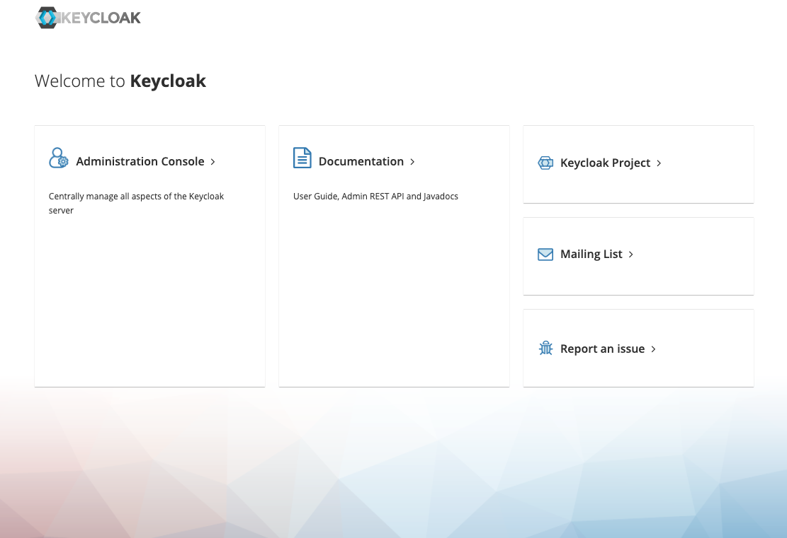
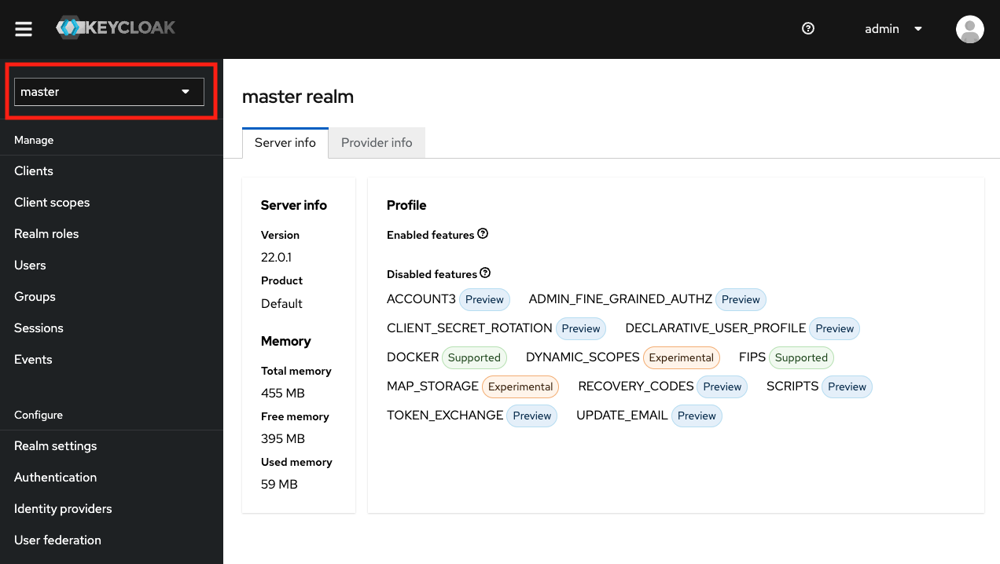
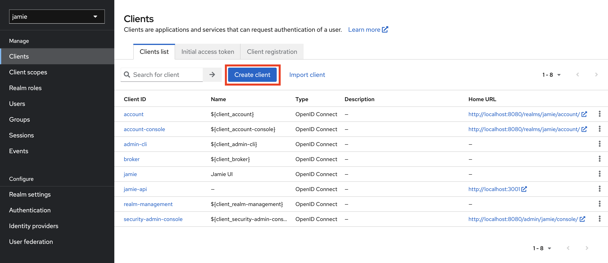
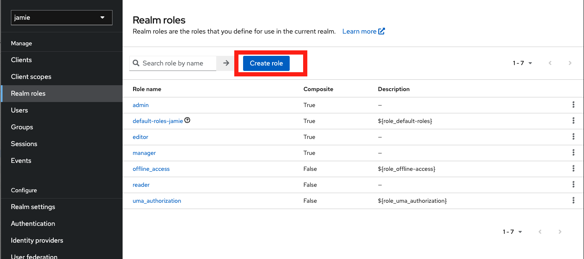
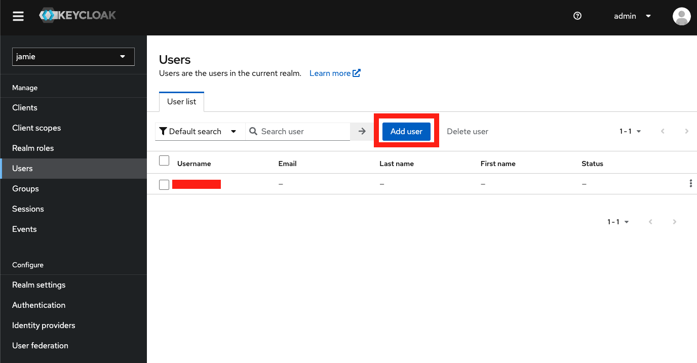
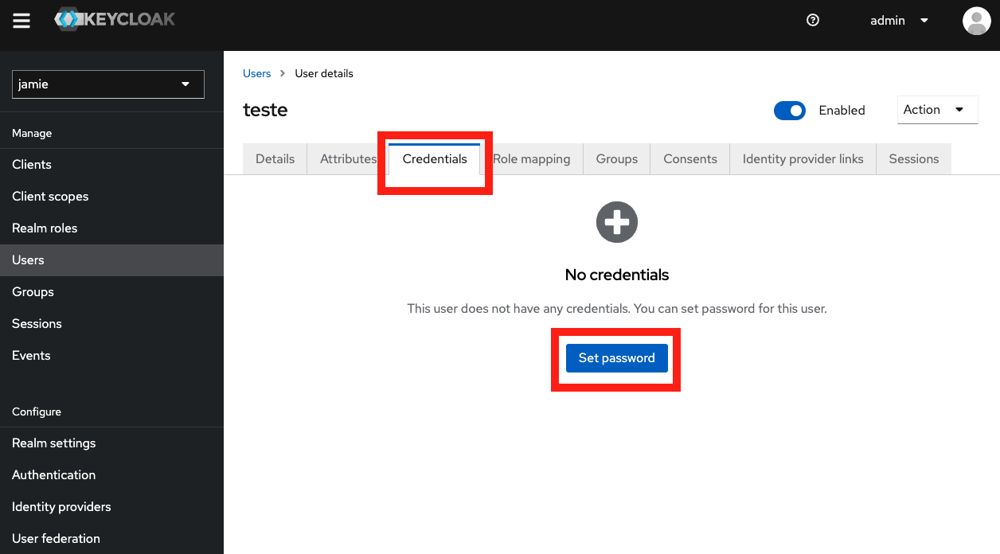

# Jamie UI

## Dependências

Para executar o projeto Jamie UI em sua máquina, é necessário configurar algumas dependências. Certifique-se de que você possui os seguintes pré-requisitos:

- [Node](https://nodejs.org/en)
- [npm](https://www.npmjs.com/)
- [yarn](https://yarnpkg.com/)
- [Docker](https://www.docker.com/)
- [Jamie API](https://github.com/bancodobrasil/jamie-api/)

## Preparativos

Siga os passos abaixo para configurar o ambiente e executar o projeto Jamie UI:

### Instalando Dependências e Inicializando Docker

Abra o diretório do projeto no terminal rode `yarn`. Em seguida, rode o comando `docker compose up -d` no mesmo diretório. O docker subirá uma aplicação do keycloak na porta `8080`, abra ela em seu browser para configuração `localhost:8080`.

### Keycloak

Após terem sido baixadas todas as dependências, será necessário configurar o keycloak para a utilização do Jamie. Em `localhost:8080`, carregará uma tela semelhante a a seguir:

Clique em `Administration Console`, abrirá uma tela de login, digite na tela
username: `admin` e password: `admin`. Se iniciará uma tela semelhante a a seguir:

    Username: admin
    Password: admin

Após isso, você precisará criar o `realm`. Para fazer isso, clique na área demarcada em vermelho na imagem. Sob a seção "Master", você encontrará a opção para criar um novo Realm. Ao abrir essa opção, a tela apresentará:

Em **Realm name** digite `jamie`, em seguida clique em create. Na tela inicil do keycloak, no mesmo lugar em que foi clicado para criar um Realm aparecerá o Realm jamie que acabamos de criar, entre nele. 

Em seguida no menu lateral clique em **Clients** e abrirá uma tela semelhante a seguir:

Clique em **Create Client**, iremos criar dois clientes, um para a Jamie UI e outro para Jamie API.

### Configuração Client Jamie UI
Preencha os campos com os seguintes dados:
 
1. **Client ID**: jamie

2. **Name**: Jamie UI

3. Em **ACCESS Settings** coloque:
    - **Valid Redirect URIs**: 
        - http://localhost:80/* 
        - http://localhost:3000/*
        - http://localhost/*

    - **Valid post logout redurect URIs**: 
        - http://localhost:80/* 
        - http://localhost:3000/*
        - http://localhost/*

    - **Web origins**: 
        - http://localhost:80
        - http://localhost:3000
        - http://localhost

4. Em **Capability config**

    **Desmarque**:
    - Client authentication
    - Authorization
    
    **Habilite(ON)**:
    - Standart flow
    - Direct aceess grants

### Configuração Client Jamie API
Preencha os campos com os seguintes dados:
 
1. **Client ID**: jamie-api

2. Em **ACCESS Settings** coloque:
    - **Root URL**: 
        - http://localhost:3001/*

    - **Home URL**: 
        - http://localhost:3001/*

    - **Admin URL**:    
        - http://localhost:3001

3. Em **Capability config**

    **Habilite(ON)**:
    - Client authentication
    - Authorization
    
    **Desmarque**:
    - Standart flow
    - Direct aceess grants

### Configuração Realm Roles

Agora precisaremos configurar os Realm Roles, serão criados 4 realms roles (reader, editor, manager, admin [opcional]). No menu lateral clique em **Realm Roles**, em seguida abrirá uma tela semelhante a seguir, e clique em **Create Role**.

Preencha os campos com os seguintes dados:

#### Reader
1. **Role name**: reader
2. Salve

#### Editor
1. **Role name**: editor
2. Em **Action** clique em **Add associated roles**, em seguida clique no role do `reader`, que criamos, e em **Assing**
3. Salve

#### Manager
1. **Role name**: editor
2. Em **Action** clique em **Add associated roles**, em seguida clique no role do `reader` e `editor`, que criamos, e em **Assing**
3. Salve

#### Admin
1. **Role name**: editor
2. Em **Action** clique em **Add associated roles**, em seguida clique no role do `reader`, `editor` e `manager`, que criamos, e em **Assing**
3. Salve

### Configuração de Usuário

No menu lateral, cliente en **Users**, em seguida clique em **Add user**, como na imagem a seguir:

Em **Username** digite um nome de usuário que você deseja, e habilite **Email verified**, não é necessário adicionar seu e-mail, apenas se você quiser.

Em seguida, clique em **Credentials** e **Set password**.

Preencha a senha e a confirmação da senha e desabilite o campo de **Temporary**. Em seguida, clique em **Role mapping**, que está ao lado de **Credencials**. Em seguida clique em `admin` e em **Assign**.

Com isso, quando entrar no Jamie será necessário colocar o usuário e a senha que você cadastrou.

### Configuração de Ambiente

Em seguida faça uma cópia do arquivo `.env.development`, deixando ele apenas ficar com o nome de `.env`. Configure a variável `JAMIE_API_BASE_URL` semelhante a seguir:

    JAMIE_API_BASE_URL=http://localhost:5000

### Jamie API

Em seguida, faça os processos do README do [Jamie API](https://github.com/bancodobrasil/jamie-api).

## Executando 

Agora temos tudo configurado, basta entrar no terminal do projeto do Jamie UI e digitar `yarn start` ele carregará a página localmente em `localhost:3000`.

<!--- 
- subir docker compose do jamie ui
`docker compose up -d`

- configurar keycloak

    criar realm `jamie`
    criar client `jamie` (para a UI)
    criar client `jamie-api` (para a api)

    criar realm roles 
        - reader
        - editor
        - manager
        - admin (opcional)

    criar seu usuário 
        definir papel de admin
        definir credencial 

- configurar as variaveis de ambiente do Jamie UI (.env)

        JAMIE_API_BASE_URL=http://localhost:5000

- subir jamie-api
<!-- colocar link do github do jamie api 
`docker compose up -d`
--->